# 📊 US Superstore Sales & Profit Analysis


---

## 📌 Project Overview

This project presents a comprehensive **Sales and Profit Analysis** of the **US Superstore** dataset using **Python**. The analysis explores customer purchasing behavior, product performance, regional sales trends, shipping efficiency, profitability, and customer segmentation.

In addition to Exploratory Data Analysis (EDA), the project includes customer segmentation using **RFM Analysis**, **Linear Regression** for profit prediction, and a **Correlation Heatmap** to understand relationships among numerical variables.

This project demonstrates an end-to-end data analytics workflow suitable for business intelligence and decision-making.

---

# ✨ Key Features

- ✅ Data Cleaning & Preprocessing
- 📊 Exploratory Data Analysis (EDA)
- 🌍 Regional Sales Analysis
- 📈 Time Series Analysis
- 🚚 Shipping & Delivery Analysis
- 📦 Product & Category Analysis
- 👥 RFM Customer Segmentation
- 🤖 Linear Regression for Profit Prediction
- 🔥 Correlation Heatmap
- 📁 Exported CSV Reports

---

## 🎯 Objectives

The primary objectives of this project are to:

- Clean and preprocess retail sales data
- Perform exploratory data analysis (EDA)
- Analyze regional and customer segment performance
- Identify top-performing and loss-making products
- Analyze monthly sales and profit trends
- Evaluate shipping performance
- Perform customer segmentation using RFM analysis
- Predict profit using Linear Regression
- Analyze feature correlations using a heatmap

---

# 📂 Project Structure

```text
US-Superstore-Sales-Profit-Analysis/
│
├── US_Superstore_Sales_Profit_Analysis.ipynb
├── US Superstore data.xls
├── README.md
├── requirements.txt
├── LICENSE
│
├── images/
│   ├── All project visualizations (.png)
│
└── outputs/
    ├── Monthly_Sales.csv
    ├── Monthly_Profit.csv
    ├── Region_Sales.csv
    ├── Segment_Profit.csv
    ├── Category_Profit.csv
    ├── Sub_Category_Profit.csv
    ├── Correlation_Matrix.csv
    ├── RFM_Table.csv
    └── Top_Customers.csv
```

---

# 📊 Dataset Information

**Dataset:** US Superstore Dataset

The dataset contains retail transaction records including:

- Order Information
- Customer Details
- Product Information
- Sales
- Profit
- Quantity
- Discount
- Shipping Information
- Region
- Category
- Sub-Category

Dataset Size:

- **Rows:** 9,994
- **Columns:** 21

---

# 🛠 Technologies Used

- Python
- Google Colab
- Pandas
- NumPy
- Matplotlib
- Seaborn
- Scikit-Learn

---

# 📈 Project Workflow

## 1️⃣ Data Loading & Cleaning

- Loaded Excel dataset
- Checked missing values
- Converted date columns
- Removed invalid quantity values
- Created Total Sales feature

---

## 2️⃣ Exploratory Data Analysis (EDA)

Performed:

- Total Orders
- Total Customers
- Customer Segments
- Product Categories
- Top Products by Sales
- Top Products by Quantity
- Top Products by Profit
- Bottom Loss-Making Products

---

## 3️⃣ Regional & Segment Analysis

Analyzed:

- Revenue by Region
- Profit by Customer Segment
- Top Customers by Profit

---

## 4️⃣ Time Series Analysis

Created:

- Monthly Sales Trend
- Monthly Profit Trend

Identified:

- Seasonal patterns
- Peak sales periods
- Profit fluctuations

---

## 5️⃣ Shipping & Delivery Analysis

Performed:

- Delivery Days Calculation
- Shipping Performance
- Delivery Time Distribution
- Delivery Time vs Profit Analysis

---

## 6️⃣ Product & Category Analysis

Analyzed:

- Category Profitability
- Sub-Category Profitability
- Loss-Making Products
- Profit Heatmap

---

# ⭐ Bonus Analysis

## RFM Customer Segmentation

Calculated:

- Recency
- Frequency
- Monetary

Segmented customers into:

- Champions
- Loyal Customers
- Recent Customers
- Big Spenders
- Others

---

## Machine Learning

Implemented:

**Linear Regression**

Model Evaluation Metrics:

- Mean Absolute Error (MAE)
- Root Mean Squared Error (RMSE)
- R² Score

---

## Correlation Analysis

Created:

- Correlation Matrix
- Correlation Heatmap
- Feature Correlation with Profit

---

# 📷 Project Visualizations

<table>
<tr>
<td align="center">

### 📈 Monthly Sales Trend

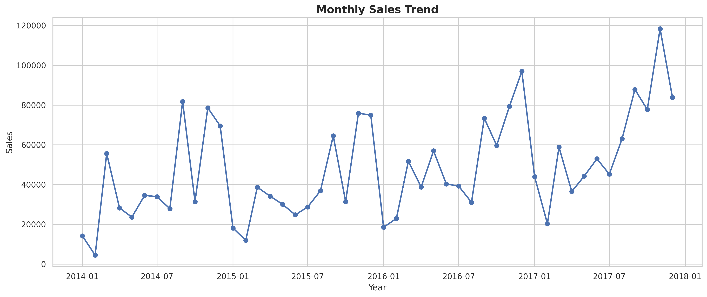

</td>

<td align="center">

### 📈 Monthly Profit Trend

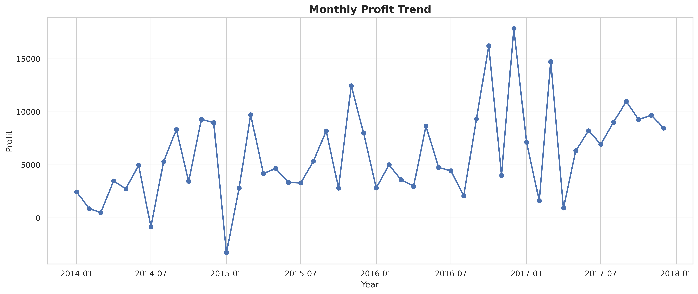

</td>
</tr>

<tr>
<td align="center">

### 🏆 Top Products by Sales

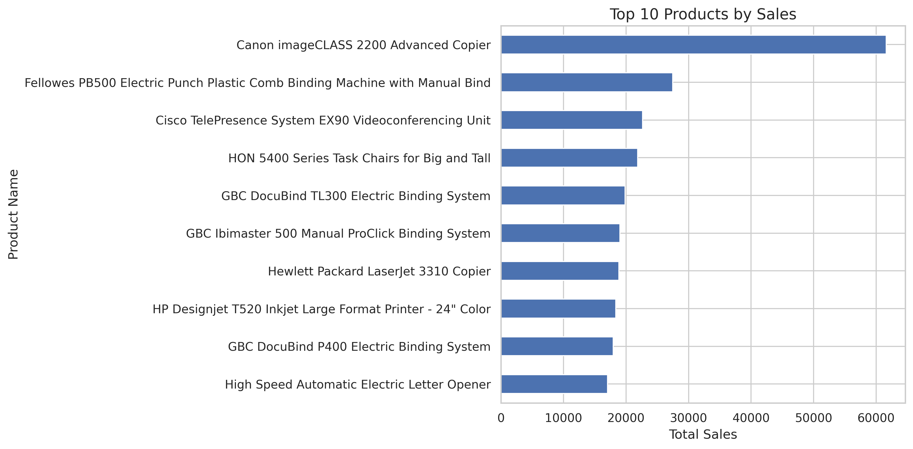

</td>

<td align="center">

### 💰 Top Products by Profit

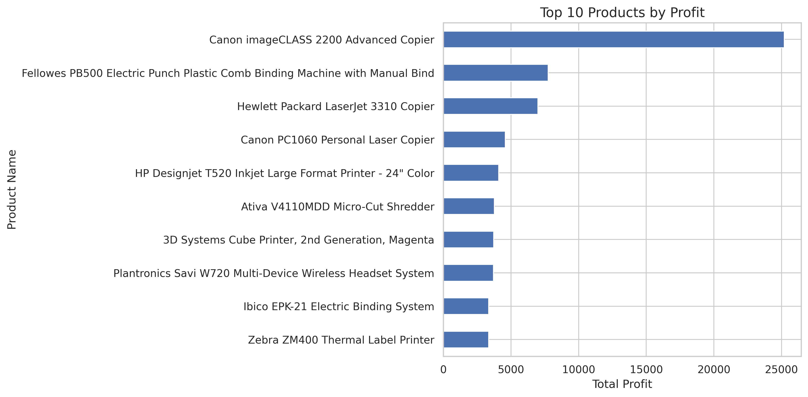

</td>
</tr>

<tr>
<td align="center">

### 🌍 Sales by Region

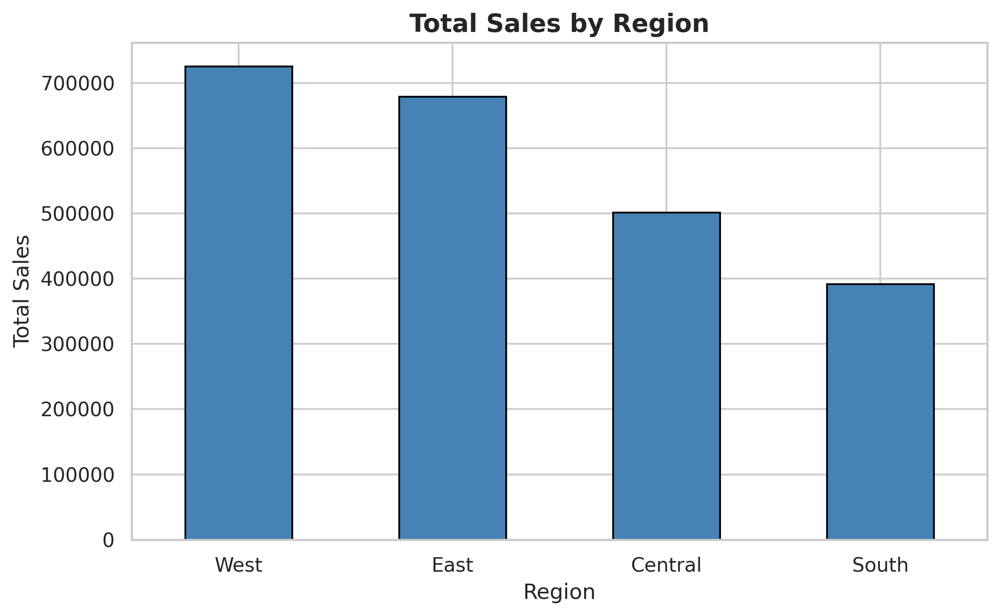

</td>

<td align="center">

### 👥 Profit by Customer Segment

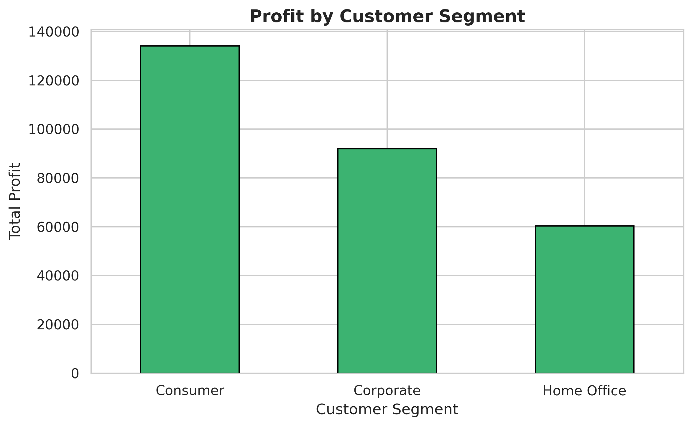

</td>
</tr>

<tr>
<td align="center">

### 🚚 Delivery Days Distribution

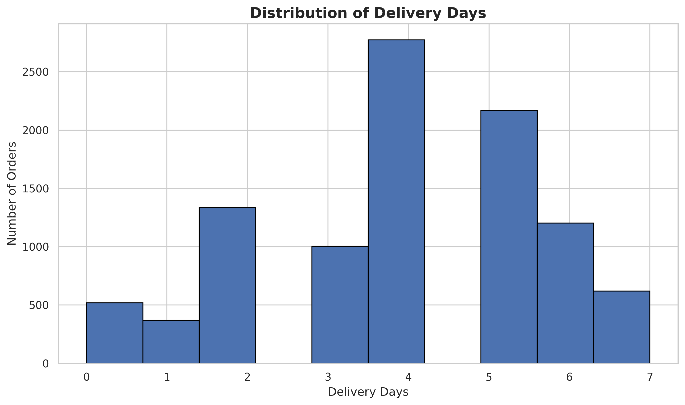

</td>

<td align="center">

### 📦 Profit by Category

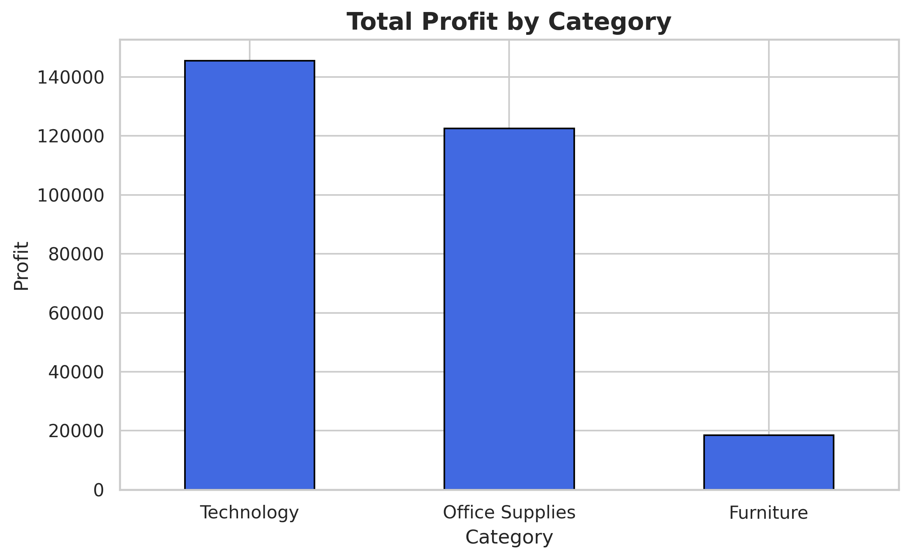

</td>
</tr>

<tr>
<td align="center">

### 📊 Profit by Sub-Category

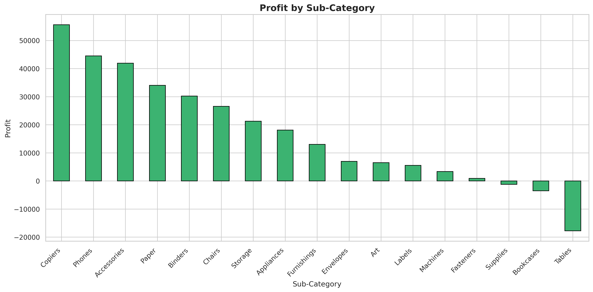

</td>

<td align="center">

### 🔥 Category vs Sub-Category Profit Heatmap

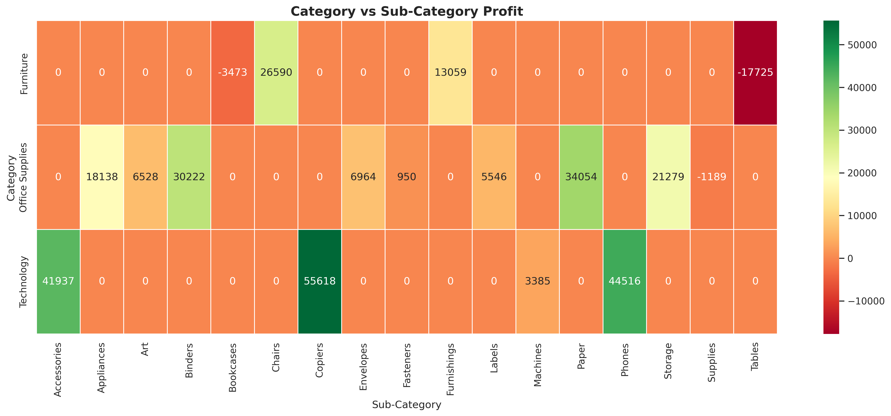

</td>
</tr>

<tr>
<td align="center">

### 👤 RFM Customer Segmentation

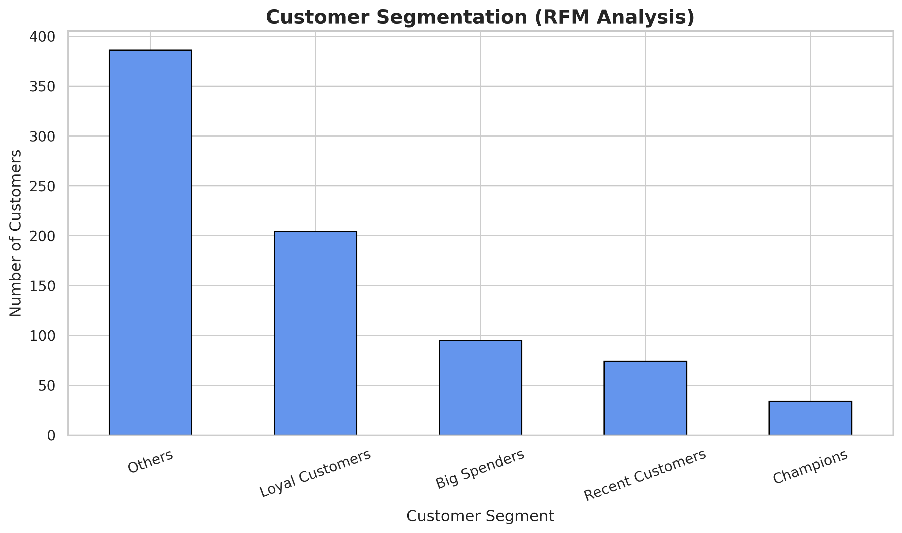

</td>

<td align="center">

### 🤖 Actual vs Predicted Profit

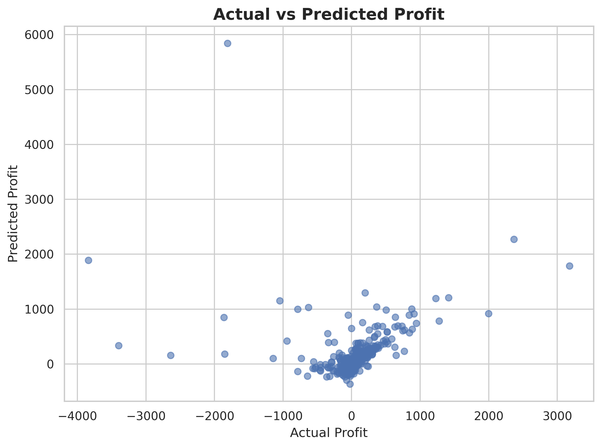

</td>
</tr>

<tr>
<td colspan="2" align="center">

### 🔥 Correlation Heatmap

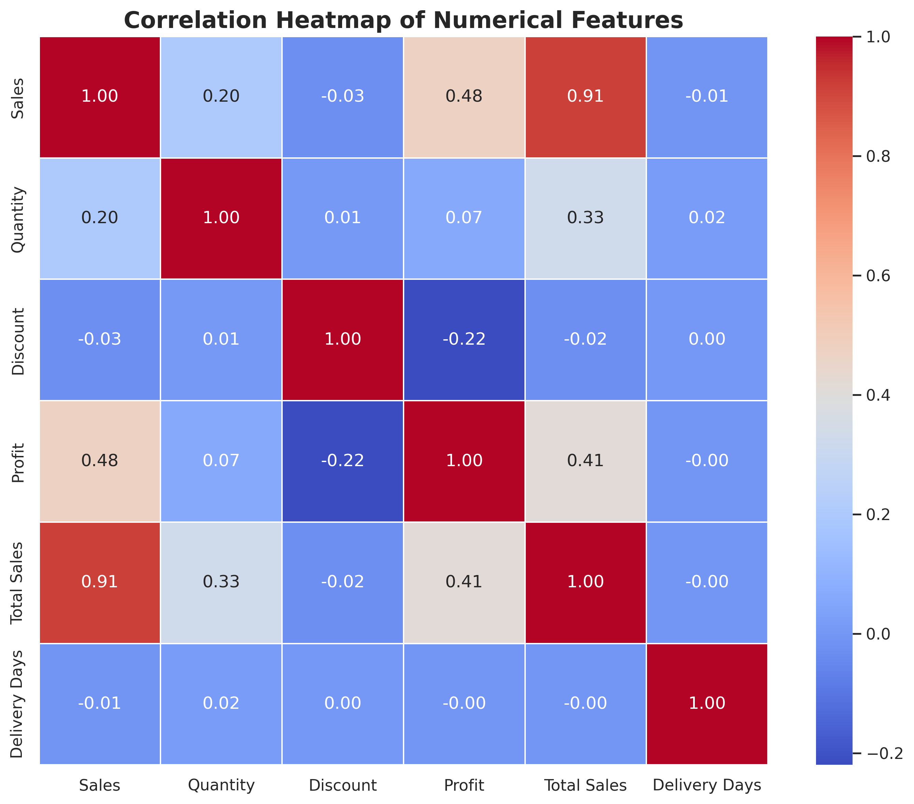

</td>
</tr>
</table>
---

# 📁 Outputs

The project exports multiple CSV files including:

- Monthly Sales
- Monthly Profit
- Region Sales
- Segment Profit
- Category Profit
- Sub-Category Profit
- Correlation Matrix
- RFM Table
- Top Customers

---

# 🚀 How to Run

### Clone Repository

```bash
git clone https://github.com/MuhammadWaqasRiaz/US-Superstore-Sales-Profit-Analysis.git
```

### Install Dependencies

```bash
pip install -r requirements.txt
```

### Open Notebook

Open

```
US_Superstore_Sales_Profit_Analysis.ipynb
```

Run all cells sequentially.

---

# 📌 Key Business Insights

- Technology products contribute significantly to revenue and profitability.
- Certain sub-categories consistently generate losses and require strategic review.
- Customer profitability varies considerably across segments.
- Shipping performance impacts customer experience and operational efficiency.
- Sales and profit exhibit seasonal trends useful for forecasting.
- RFM segmentation helps identify high-value customers for targeted marketing.
- Linear Regression provides a baseline model for profit prediction.

---

# 🔮 Future Improvements

Potential future enhancements include:

- Dashboard development using Power BI or Tableau
- Advanced forecasting models
- Customer churn prediction
- Product recommendation system
- Inventory optimization
- XGBoost and Random Forest regression models
- Interactive dashboards using Plotly

---

# 👨‍💻 Author

**Muhammad Waqas Riaz**

MS Artificial Intelligence

Islamia University of Bahawalpur

GitHub:
https://github.com/MuhammadWaqasRiaz

LinkedIn:
https://www.linkedin.com/in/mwaqas5545/

---

# ⭐ Support

If you found this project helpful, please consider giving it a ⭐ on GitHub.
